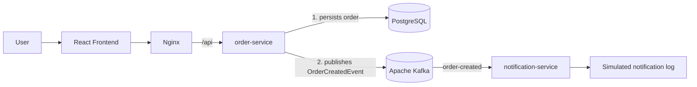

# Fulfill

[Versao em portugues](README.md)

Fulfill is an order management platform created to demonstrate an event-driven microservices architecture in practice.

The system allows users to create, list, and view orders through a React frontend. When an order is created, the backend persists the data in PostgreSQL and publishes an event to Apache Kafka, which is consumed asynchronously by a notification service.

## Overview

- `frontend`: React application with TypeScript for creating, listing, and viewing orders.
- `order-service`: Spring Boot REST API responsible for orders, persistence, and event publishing.
- `notification-service`: Spring Boot microservice that consumes Kafka events and simulates notifications through logs.
- `docker-compose.yml`: orchestrates PostgreSQL, Kafka, the backend services, and the frontend.

The main project flow is:

```text
Frontend -> order-service -> PostgreSQL -> Kafka -> notification-service
```

## Architecture



In the Docker environment, Nginx serves the frontend static files and also acts as a reverse proxy. The browser calls `/api`, and Nginx forwards the request to `order-service` inside the Docker network.

## Technologies

- Java 17
- Spring Boot
- React
- TypeScript
- Vite
- PostgreSQL
- JPA / Hibernate
- Flyway
- Apache Kafka
- Docker
- Docker Compose
- Nginx
- JUnit 5
- Mockito

## Main Flow

1. The user creates an order in the frontend.
2. The frontend calls the `order-service` through REST.
3. The `order-service` validates the received data.
4. The order is persisted in PostgreSQL with status `CREATED`.
5. After persistence, the `order-service` publishes an `OrderCreatedEvent` to Kafka.
6. Kafka delivers the event through the `order-created` topic.
7. The `notification-service` consumes the event using the `notification-service` consumer group.
8. The `notification-service` processes a simulated notification through logs.

## How to Run

Prerequisites:

- Docker
- Docker Compose

Start the entire application from the project root:

```bash
docker compose up --build
```

Run in detached mode:

```bash
docker compose up --build -d
```

Access the frontend:

```text
http://localhost:5173
```

Exposed ports:

- `5173`: frontend served by Nginx
- `8080`: `order-service` API
- `5432`: PostgreSQL
- `9092`: Kafka for clients running on the host

Stop the stack:

```bash
docker compose down
```

Stop the stack and remove volumes:

```bash
docker compose down -v
```

## Main Endpoints

### Create order

```http
POST /api/orders
Content-Type: application/json
```

```json
{
  "customerName": "Ana Souza",
  "customerEmail": "ana@example.com",
  "totalAmount": 99.80
}
```

### List orders

```http
GET /api/orders
```

### Get order by ID

```http
GET /api/orders/{id}
```

### Response example

```json
{
  "id": "5c6cc3ce-4b52-4cb6-9b16-86fa85920c2f",
  "customerName": "Ana Souza",
  "customerEmail": "ana@example.com",
  "status": "CREATED",
  "totalAmount": 99.80,
  "createdAt": "2026-08-17T21:30:00Z"
}
```

## Kafka Event

The `order-service` publishes the event below after saving the order in the database.

Topic:

```text
order-created
```

Event:

```json
{
  "orderId": "5c6cc3ce-4b52-4cb6-9b16-86fa85920c2f",
  "customerName": "Ana Souza",
  "customerEmail": "ana@example.com",
  "status": "CREATED",
  "totalAmount": 99.80,
  "createdAt": "2026-08-17T21:30:00Z"
}
```

## Tests

Backend:

```bash
cd order-service
mvn test

cd ../notification-service
mvn test
```

Frontend:

```bash
cd frontend
npm test
npm run build
```

## Screenshot

Add an application screenshot here after capturing the frontend screen.

Suggested format:

```markdown

```

## Technical Decisions

- Kafka was used to decouple order creation from notification processing.
- The `order-service` persists the order before publishing the event, keeping the database as the initial source of truth.
- Kafka publishing is handled by a dedicated component, separate from the controller and repository.
- The `notification-service` uses its own consumer group named `notification-service`.
- Flyway versions the database schema, avoiding reliance on `ddl-auto=create` or `ddl-auto=update`.
- The frontend uses Nginx as both a static file server and a reverse proxy for `/api` in the Docker environment.
- Docker Compose makes it possible to run the full application with a single command.
- The project was developed incrementally: orders, Kafka producer, consumer, frontend, and containerization.

## Trade-offs and Future Improvements

- There is still a consistency window between persisting the order in PostgreSQL and publishing the event to Kafka.
- A natural next step would be applying the Transactional Outbox pattern to make event publishing more reliable.
- Retry and Dead Letter Topic support could be added later to handle consumer failures.
- Notifications are simulated through logs; real email delivery is outside the current scope.
- The project does not currently include authentication, an API gateway, advanced observability, or an `inventory-service`.
