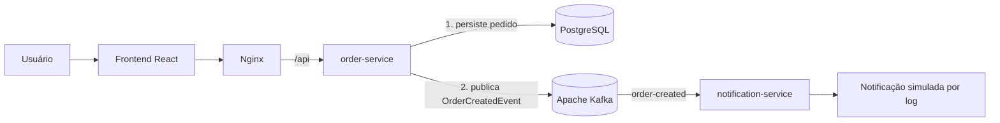

# Fulfill

Fulfill é uma plataforma de gerenciamento de pedidos criada para demonstrar, de forma prática, uma arquitetura de microsserviços orientada a eventos.

O sistema permite criar, listar e visualizar pedidos por meio de um frontend em React. Ao criar um pedido, o backend persiste os dados em PostgreSQL e publica um evento no Apache Kafka, que é consumido de forma assíncrona por um serviço de notificações.

## Visão Geral

- `frontend`: aplicação React com TypeScript para criação, listagem e visualização de pedidos.
- `order-service`: API REST em Spring Boot responsável por pedidos, persistência e publicação de eventos.
- `notification-service`: microsserviço Spring Boot que consome eventos Kafka e simula notificações por log.
- `docker-compose.yml`: orquestra PostgreSQL, Kafka, backend, consumer e frontend.

O fluxo principal do projeto é:

```text
Frontend -> order-service -> PostgreSQL -> Kafka -> notification-service
```

## Arquitetura



No ambiente Docker, o Nginx serve os arquivos estáticos do frontend e também atua como reverse proxy. O navegador chama `/api`, e o Nginx encaminha a requisição para o `order-service` dentro da rede Docker.

## Tecnologias

- Java 17
- Spring Boot
- React
- TypeScript
- Vite
- PostgreSQL
- JPA / Hibernate
- Flyway
- Apache Kafka
- Docker
- Docker Compose
- Nginx
- JUnit 5
- Mockito

## Fluxo Principal

1. O usuário cria um pedido no frontend.
2. O frontend chama o `order-service` via REST.
3. O `order-service` valida os dados recebidos.
4. O pedido é persistido no PostgreSQL com status `CREATED`.
5. Após a persistência, o `order-service` publica um `OrderCreatedEvent` no Kafka.
6. O Kafka entrega o evento no tópico `order-created`.
7. O `notification-service` consome o evento usando o consumer group `notification-service`.
8. O `notification-service` processa uma notificação simulada por log.

## Como Executar

Pré-requisitos:

- Docker
- Docker Compose

Suba toda a aplicação a partir da raiz do projeto:

```bash
docker compose up --build
```

Para executar em segundo plano:

```bash
docker compose up --build -d
```

Acesse o frontend:

```text
http://localhost:5173
```

Portas expostas:

- `5173`: frontend servido por Nginx
- `8080`: API do `order-service`
- `5432`: PostgreSQL
- `9092`: Kafka para clientes executados no host

Encerrar a stack:

```bash
docker compose down
```

Encerrar e remover volumes:

```bash
docker compose down -v
```

## Endpoints Principais

### Criar pedido

```http
POST /api/orders
Content-Type: application/json
```

```json
{
  "customerName": "Ana Souza",
  "customerEmail": "ana@example.com",
  "totalAmount": 99.80
}
```

### Listar pedidos

```http
GET /api/orders
```

### Consultar pedido por ID

```http
GET /api/orders/{id}
```

### Exemplo de resposta

```json
{
  "id": "5c6cc3ce-4b52-4cb6-9b16-86fa85920c2f",
  "customerName": "Ana Souza",
  "customerEmail": "ana@example.com",
  "status": "CREATED",
  "totalAmount": 99.80,
  "createdAt": "2026-08-17T21:30:00Z"
}
```

## Evento Kafka

O `order-service` publica o evento abaixo após salvar o pedido no banco.

Tópico:

```text
order-created
```

Evento:

```json
{
  "orderId": "5c6cc3ce-4b52-4cb6-9b16-86fa85920c2f",
  "customerName": "Ana Souza",
  "customerEmail": "ana@example.com",
  "status": "CREATED",
  "totalAmount": 99.80,
  "createdAt": "2026-08-17T21:30:00Z"
}
```

## Testes

Backend:

```bash
cd order-service
mvn test

cd ../notification-service
mvn test
```

Frontend:

```bash
cd frontend
npm test
npm run build
```

## Screenshot

Adicione aqui uma imagem da aplicação depois de capturar a tela do frontend.

Sugestão:

```markdown

```

## Decisões Técnicas

- Kafka foi usado para desacoplar a criação do pedido do processamento da notificação.
- O `order-service` persiste o pedido antes de publicar o evento, preservando o banco como fonte inicial de verdade.
- A publicação no Kafka fica em um componente próprio, separado do controller e do repositório.
- O `notification-service` usa um consumer group próprio chamado `notification-service`.
- Flyway versiona o schema do banco, evitando depender de `ddl-auto=create` ou `ddl-auto=update`.
- O frontend usa Nginx como servidor estático e reverse proxy para `/api` no ambiente Docker.
- Docker Compose permite subir a aplicação completa com um único comando.
- O projeto foi desenvolvido de forma incremental: pedidos, producer Kafka, consumer, frontend e containerização.

## Trade-offs e Evoluções Futuras

- Existe uma janela de inconsistência entre persistir o pedido no PostgreSQL e publicar o evento no Kafka.
- Uma evolução natural seria aplicar Transactional Outbox para tornar a publicação de eventos mais confiável.
- Retry e Dead Letter Topic podem ser adicionados em uma etapa futura para tratar falhas no consumo.
- As notificações são simuladas por log; envio real de e-mail não faz parte do escopo atual.
- O projeto ainda não possui autenticação, gateway de API, observabilidade avançada ou `inventory-service`.
